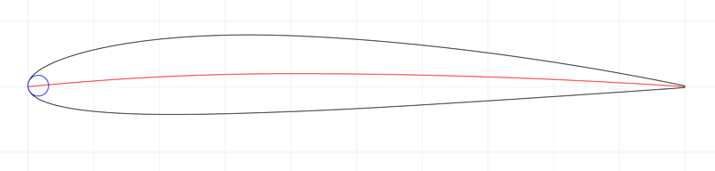

# naca-four-digit-airfoil

[](https://travis-ci.org/rreusser/naca-four-digit-airfoil) [](http://standardjs.com/)

> The equations for a NACA four-digit series airfoil

## Introduction

NACA airfoils map a four digit code to an airfoil shape. For example, a '2412' airfoil is parsed to mean:

- The leading '2' indicates 0.02% maximum camber
- The '4' indicates maximum camber at 40% of the chord length
- The '12' indicates maximum thickness of 12% of the chord length

[](http://rickyreusser.com/naca-four-digit-airfoil/?naca=2412)

Live examples (change the query string to create your own):

- [NACA 2412](http://rickyreusser.com/naca-four-digit-airfoil?naca=2412)
- [NACA 0012](http://rickyreusser.com/naca-four-digit-airfoil?naca=0012)
- [NACA 3418](http://rickyreusser.com/naca-four-digit-airfoil?naca=3418)

## Example

The code below calculates the x- and y-coordinates of the upper and lower surfaces, respectively, at 50% of the chord length.

```javascript
var naca = require('naca-four-digit-airfoil')

naca('2412').evaluate(0.5)
// => [ 0.5005881887154037, 0.07238142883077964, 0.4994118112845963, -0.03349253994189075 ]
```

## Installation

```bash
$ npm install naca-four-digit-airfoil
```

## API

#### `require('naca-four-digit-airfoil')(nacaAirfoilCode[, chordLength = 1])`
Parses the airfoil code and returns an object with functions that evaluate the shape of the airfoil for a unit chord length. Arguments are:

- **`nacaAirfoilCode`**: A four-digit string containing the NACA airfoil code. The first digit is the amount of camber in units of 1% of the chord length. The second digit is the location of maximum camber measured from the leading edge in units of 10% of the chord length. The final two digits are the thickness of the airfoil in units of 1% of the chord length.
- **`chordLength`** (optional, default = 1): The chord length of the airfoil.

The object returned contains the following functions:

- **`thickness: function(x)`**: The half-thickness of the airfoil above or below the camber line at position x.
- **`camberLine: function(x)`**: The height of the camber line above the centerline at position `x`.
- **`camberLineSlope: function(x)`**: The slope of the camber line at position `x`.
- **`leadingEdgeRadius: function()`**: The radius of curvature of the leading edge.
- **`evaluate: function(x)`**: The coordinates of the surface at position `x`. Returned in a four-element array containing coordinates `[xUpper, yUpper, xLower, yLower]`. The coordinates are calculated perpendicular to the line of camber. So that the x-coordinate of the surface at chord position `x` is slightly perturbed.
- **`xUpper: function(x)`**: The x-coordinate of the upper surface of the airfoil.
- **`yUpper: function(x)`**: The y-coordinate of the upper surface of the airfoil.
- **`xLower: function(x)`**: The x-coordinate of the lower surface of the airfoil.
- **`yLower: function(x)`**: The y-coordinate of the lower surface of the airfoil.

## License

&copy; 2016 Ricky Reusser. MIT License.
